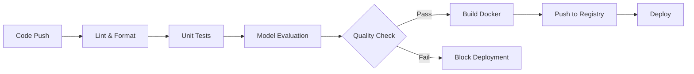

# Model Evaluation

Tài liệu này mô tả quy trình đánh giá model trong MLOps pipeline.

## Tổng quan

Script `evaluate.py` đánh giá chất lượng của model Pix2PixHD đã được train bằng cách so sánh ảnh được sinh ra với ảnh ground truth trên tập test.

## Metrics

### 1. SSIM (Structural Similarity Index)
- **Mô tả**: Đo lường độ tương đồng về cấu trúc giữa hai ảnh
- **Phạm vi**: 0 đến 1 (càng cao càng tốt)
- **Ý nghĩa**: SSIM = 1 nghĩa là hai ảnh giống hệt nhau
- **Threshold**: Tối thiểu 0.3 cho quality validation

### 2. PSNR (Peak Signal-to-Noise Ratio)
- **Mô tả**: Đo lường tỷ lệ giữa tín hiệu cực đại và nhiễu
- **Đơn vị**: decibel (dB)
- **Phạm vi**: Thường từ 20-50 dB (càng cao càng tốt)
- **Ý nghĩa**:
  - PSNR < 20 dB: Chất lượng kém
  - PSNR 20-30 dB: Chất lượng trung bình
  - PSNR > 30 dB: Chất lượng tốt
- **Threshold**: Tối thiểu 10.0 dB cho quality validation

### 3. L1 Loss (Mean Absolute Error)
- **Mô tả**: Trung bình sai số tuyệt đối giữa các pixel
- **Phạm vi**: 0 đến ∞ (càng thấp càng tốt)
- **Ý nghĩa**: Đo lường sự khác biệt trung bình giữa ảnh sinh ra và ảnh thật

## Cách sử dụng

### Chạy evaluation locally

```bash
# Từ thư mục gốc của project
python mlops/modeling/evaluate.py

# Với custom config
python mlops/modeling/evaluate.py training.num_epochs=10
```

### Output

Script sẽ tạo các files sau:

1. **`reports/evaluation_metrics.json`**: Các metrics tổng hợp
   ```json
   {
     "ssim_mean": 0.85,
     "ssim_std": 0.05,
     "psnr_mean": 28.5,
     "psnr_std": 2.3,
     "l1_loss_mean": 0.12,
     "l1_loss_std": 0.03,
     "num_test_samples": 100
   }
   ```

2. **`reports/samples/`**: Ảnh mẫu để kiểm tra visual
   - `sample_0_sketch.png`: Ảnh sketch đầu vào
   - `sample_0_real.png`: Ảnh thật (ground truth)
   - `sample_0_generated.png`: Ảnh sinh ra từ model
   - `sample_0_comparison.png`: So sánh 3 ảnh cạnh nhau

## MLOps Pipeline Integration

### GitHub Actions Workflow

Evaluation được tích hợp vào CI/CD pipeline với các bước sau:

```yaml
evaluate-model:
  needs: test-and-lint
  steps:
    1. Setup Python environment
    2. Install dependencies
    3. Pull data (DVC hoặc Git LFS)
    4. Train model nếu chưa có checkpoint
    5. Run evaluation
    6. Upload artifacts (metrics, images)
    7. Validate model quality
```

### Model Quality Validation

Pipeline tự động kiểm tra chất lượng model dựa trên thresholds:

- **SSIM ≥ 0.3**: Model có khả năng bảo toàn cấu trúc cơ bản
- **PSNR ≥ 10.0 dB**: Model có chất lượng tái tạo tối thiểu chấp nhận được

Nếu model không đạt thresholds, pipeline sẽ fail và không deploy.

### Artifacts

Các artifacts được upload trong mỗi run:

1. **evaluation-metrics**: JSON files chứa metrics
2. **evaluation-samples**: Ảnh mẫu để visual inspection

## MLOps Flow hoàn chỉnh



### Các bước trong pipeline:

1. **CI - Code Quality**
   - Lint với Ruff
   - Format check
   - Unit tests với pytest

2. **Model Evaluation** ⭐ NEW
   - Load test data
   - Run inference
   - Calculate metrics (SSIM, PSNR, L1)
   - Generate sample images
   - Validate quality thresholds

3. **CD - Deployment**
   - Build Docker image
   - Push to Docker Hub
   - Deploy to production (manual/auto)

## Best Practices

### 1. Thường xuyên đánh giá model
- Chạy evaluation sau mỗi lần train
- Track metrics qua thời gian với MLflow/WandB

### 2. Visual inspection
- Luôn xem sample images để đánh giá qualitative
- Metrics không phản ánh hoàn toàn chất lượng visual

### 3. Adjust thresholds
- Thresholds mặc định (SSIM=0.3, PSNR=10) rất thấp
- Tùy theo use case, có thể tăng lên:
  - Production model: SSIM > 0.7, PSNR > 25
  - Research model: SSIM > 0.8, PSNR > 30

### 4. A/B Testing
- So sánh metrics giữa các versions
- Chỉ deploy nếu metrics cải thiện

## Troubleshooting

### Lỗi: "No checkpoint found"
```bash
# Train model trước khi evaluate
python mlops/modeling/train.py
python mlops/modeling/evaluate.py
```

### Lỗi: "Dataset too small"
```bash
# Cần ít nhất 2 samples cho train/test split
# Prepare data trước
python mlops/download_and_prepare_data.py
```

### Metrics thấp bất thường
- Kiểm tra model có train đúng không
- Kiểm tra data quality
- Xem sample images để debug visual

## Mở rộng

### Thêm metrics khác

Có thể thêm các metrics sau vào `evaluate.py`:

1. **FID Score**: Đo lường quality của generated images
2. **LPIPS**: Learned Perceptual Image Patch Similarity
3. **Inception Score**: Đánh giá diversity và quality
4. **User Studies**: Human evaluation

### MLflow Integration

Tất cả metrics được log vào MLflow:

```bash
# Xem results
mlflow ui

# Compare runs
mlflow experiments search
```

## Tham khảo

- [SSIM Paper](https://ieeexplore.ieee.org/document/1284395)
- [PSNR Explanation](https://en.wikipedia.org/wiki/Peak_signal-to-noise_ratio)
- [Pix2PixHD Paper](https://arxiv.org/abs/1711.11585)
