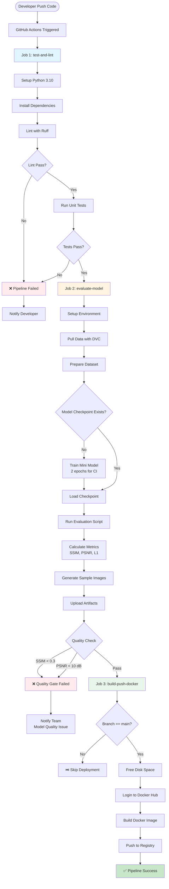

# MLOps Pipeline - Quy trình hoàn chỉnh

Tài liệu này mô tả chi tiết quy trình MLOps hoàn chỉnh cho dự án Pix2PixHD, bao gồm các giai đoạn từ development đến deployment.

## 🎯 Mục tiêu

MLOps pipeline được thiết kế để:

1. **Tự động hóa**: Giảm thiểu manual work, tăng tốc độ phát triển
2. **Đảm bảo chất lượng**: Kiểm tra code và model quality tự động
3. **Tái lập được**: Đảm bảo kết quả có thể reproduce
4. **Minh bạch**: Track và visualize mọi thay đổi
5. **An toàn**: Quality gates để tránh deploy model kém chất lượng

## 📊 Workflow Diagram



## 🔄 Các Giai đoạn Chi tiết

### Stage 1: Code Quality & Testing (test-and-lint)

**Trigger**: Mọi push hoặc PR vào branch `main` hoặc `dev`

**Steps**:

1. **Setup Environment**
   ```yaml
   - Python 3.10
   - Pip cache enabled
   - Install requirements.txt & requirements-dev.txt
   ```

2. **Lint & Format Check**
   ```bash
   ruff check .        # Static analysis
   ruff format --check . # Format verification
   ```

   Kiểm tra:
   - Code style (PEP 8)
   - Unused imports
   - Complexity issues
   - Potential bugs

3. **Unit Tests**
   ```bash
   pytest tests/
   ```

   Tests coverage:
   - Config loading (Hydra)
   - Data processing functions
   - Model initialization
   - Dataset loading

**Output**:
- ✅ Pass → Proceed to evaluation
- ❌ Fail → Block pipeline, notify developer

---

### Stage 2: Model Evaluation (evaluate-model) ⭐

**Trigger**: Sau khi test-and-lint pass

**Dependencies**:
- test-and-lint job phải thành công
- Cần data và model checkpoint (hoặc train mới)

**Steps**:

#### 2.1 Environment Setup
```yaml
- Setup Python 3.10 with pip cache
- Install dependencies + scikit-image for metrics
```

#### 2.2 Data Preparation
```bash
# Pull data from DVC (if configured)
dvc pull

# Or run data preparation script
python mlops/download_and_prepare_data.py
```

#### 2.3 Model Loading/Training
```bash
# Check if checkpoint exists
if [ ! -f "models/checkpoints/generator_latest.pth" ]; then
    # Train minimal model for CI (2 epochs)
    python mlops/modeling/train.py training.num_epochs=2
else
    # Use existing checkpoint
    echo "Using existing model"
fi
```

#### 2.4 Run Evaluation
```bash
python mlops/modeling/evaluate.py
```

Evaluation script thực hiện:

```python
# 1. Load test dataset (20% split)
test_loader = create_test_loader()

# 2. Run inference
for batch in test_loader:
    sketch = batch['feature']
    real_image = batch['label']
    fake_image = generator(sketch)

    # 3. Calculate metrics
    ssim = structural_similarity(real_image, fake_image)
    psnr = peak_signal_noise_ratio(real_image, fake_image)
    l1 = mean_absolute_error(real_image, fake_image)

# 4. Save results
save_metrics("reports/evaluation_metrics.json")
save_sample_images("reports/samples/")
```

#### 2.5 Upload Artifacts
```yaml
- name: evaluation-metrics
  files:
    - reports/evaluation_metrics.json
    - reports/metrics.json

- name: evaluation-samples
  files:
    - reports/samples/*.png
```

#### 2.6 Quality Validation
```python
# Python script to check thresholds
metrics = load_json("reports/evaluation_metrics.json")

SSIM_THRESHOLD = 0.3
PSNR_THRESHOLD = 10.0

if metrics['ssim_mean'] < SSIM_THRESHOLD:
    sys.exit(1)  # Fail pipeline

if metrics['psnr_mean'] < PSNR_THRESHOLD:
    sys.exit(1)  # Fail pipeline

print("✅ Quality validation passed")
```

**Output**:
- Metrics JSON file
- Sample comparison images
- Quality gate: Pass/Fail

**Why this matters**:
- Catch regression in model quality
- Prevent deployment of broken models
- Provide visual evidence of model performance
- Track metrics over time

---

### Stage 3: Build & Deploy (build-push-docker)

**Trigger**:
- Sau khi evaluate-model pass
- Chỉ chạy trên branch `main`

**Dependencies**:
```yaml
needs: [test-and-lint, evaluate-model]
if: github.ref == 'refs/heads/main'
```

**Steps**:

#### 3.1 Free Disk Space
```bash
# GitHub runners có limited space (~14GB)
sudo rm -rf /usr/share/dotnet
sudo rm -rf /usr/local/lib/android
sudo rm -rf /opt/ghc
docker system prune -af
```

#### 3.2 Docker Build & Push
```yaml
- Login to Docker Hub
  credentials: DOCKERHUB_USERNAME, DOCKERHUB_TOKEN

- Build image from Dockerfile
  context: .

- Push with tag
  tag: username/sketch2image-mlops:latest
```

**Output**:
- Docker image trong registry
- Sẵn sàng deploy

---

## 📈 Metrics Tracking

### MLflow

Tất cả metrics được track trong MLflow:

```python
with mlflow.start_run(run_name="evaluation"):
    mlflow.log_metric("ssim_mean", ssim)
    mlflow.log_metric("psnr_mean", psnr)
    mlflow.log_metric("l1_loss_mean", l1)

    mlflow.log_artifact("reports/evaluation_metrics.json")
    mlflow.log_artifact("reports/samples/comparison.png")
```

Xem results:
```bash
mlflow ui --port 5000
# Open http://localhost:5000
```

### GitHub Actions Artifacts

Mọi run đều lưu artifacts:

1. **evaluation-metrics**: JSON files với metrics
2. **evaluation-samples**: Sample images để visual inspection

Download từ GitHub Actions UI → Artifacts section

---

## 🚨 Quality Gates & Thresholds

Pipeline có các quality gates tại nhiều điểm:

| Gate | Metric | Threshold | Action if Failed |
|------|--------|-----------|------------------|
| **Lint** | Ruff errors | 0 errors | ❌ Block PR |
| **Tests** | Pytest pass rate | 100% | ❌ Block PR |
| **SSIM** | Structural similarity | ≥ 0.3 | ❌ Block deployment |
| **PSNR** | Peak SNR | ≥ 10 dB | ❌ Block deployment |
| **Docker Build** | Build success | Success | ❌ Alert team |

### Adjusting Thresholds

Thresholds hiện tại rất thấp để demo. Trong production:

```python
# Development/CI
SSIM_THRESHOLD = 0.3  # Very low, just sanity check
PSNR_THRESHOLD = 10.0

# Staging
SSIM_THRESHOLD = 0.6  # Moderate quality
PSNR_THRESHOLD = 20.0

# Production
SSIM_THRESHOLD = 0.75  # High quality
PSNR_THRESHOLD = 25.0
```

Edit trong `.github/workflows/python-app.yml`:

```yaml
- name: Validate model quality
  run: |
    python - <<'EOF'
    SSIM_THRESHOLD = 0.75  # Change here
    PSNR_THRESHOLD = 25.0  # Change here
    ...
    EOF
```

---

## 🔧 Configuration

### Environment Variables

**GitHub Secrets** (Settings → Secrets and variables → Actions):

```
WANDB_API_KEY           # Weights & Biases API key
DOCKERHUB_USERNAME      # Docker Hub username
DOCKERHUB_TOKEN         # Docker Hub access token
```

### Workflow Triggers

Edit `.github/workflows/python-app.yml`:

```yaml
on:
  push:
    branches: ["main", "dev"]  # Run on these branches
  pull_request:
    branches: ["main"]          # Run on PRs to main
```

### Job Configuration

```yaml
jobs:
  test-and-lint:
    runs-on: ubuntu-latest    # OS

  evaluate-model:
    needs: test-and-lint      # Dependencies
    runs-on: ubuntu-latest

  build-push-docker:
    needs: [test-and-lint, evaluate-model]
    if: github.ref == 'refs/heads/main'  # Condition
    runs-on: ubuntu-latest
```

---

## 📊 Monitoring & Observability

### 1. GitHub Actions Dashboard

Xem pipeline status:
- **Actions tab** → Workflows
- Click vào run để xem logs
- Download artifacts

### 2. MLflow UI

Track experiments:
```bash
cd /path/to/project
mlflow ui --backend-store-uri mlruns/
```

So sánh runs:
- Select multiple runs
- Click "Compare"
- Visualize metrics over time

### 3. Weights & Biases (Optional)

Real-time training monitoring:
```python
# In train.py
wandb.init(project="pix2pixhd")
wandb.log({"g_loss": g_loss, "d_loss": d_loss})
```

Dashboard: https://wandb.ai/your-team/pix2pixhd

### 4. Docker Hub

Monitor images:
- Hub → Repositories → sketch2image-mlops
- Check tags, size, last pushed

---

## 🐛 Troubleshooting

### Pipeline Failed tại Lint Stage

**Symptom**: Ruff check failed

**Solution**:
```bash
# Locally fix issues
ruff check . --fix
ruff format .

# Commit and push
git add .
git commit -m "Fix lint issues"
git push
```

### Pipeline Failed tại Test Stage

**Symptom**: Pytest failed

**Solution**:
```bash
# Run tests locally
pytest tests/ -v

# Fix failing tests
# Commit and push
```

### Pipeline Failed tại Evaluation Stage

**Symptom**: "Model quality validation failed"

**Possible causes**:
1. Model chưa train đủ
2. Data quality issues
3. Thresholds quá cao

**Solution**:
```bash
# Train model locally với nhiều epochs hơn
python mlops/modeling/train.py training.num_epochs=50

# Run evaluation locally
python mlops/modeling/evaluate.py

# Check metrics
cat reports/evaluation_metrics.json

# If metrics good, push checkpoint
dvc add models/checkpoints/
git add models/checkpoints.dvc
git commit -m "Update model checkpoint"
git push
```

### Out of Disk Space

**Symptom**: Docker build failed - no space left

**Solution**: Already handled in workflow:
```yaml
- name: Free disk space
  run: |
    sudo rm -rf /usr/share/dotnet
    sudo rm -rf /usr/local/lib/android
    docker system prune -af
```

If still fails, reduce image size:
- Use smaller base image
- Clean up unnecessary files in Dockerfile
- Use multi-stage builds

### DVC Pull Failed

**Symptom**: Data not available

**Solution**:
```yaml
# In workflow, already has continue-on-error
- name: Pull data with DVC
  run: dvc pull
  continue-on-error: true
```

Make sure:
1. DVC remote configured: `dvc remote list`
2. Credentials set: `dvc remote modify myremote --local auth basic`
3. Data pushed: `dvc push`

---

## 🚀 Best Practices

### 1. Development Workflow

```bash
# 1. Create feature branch
git checkout -b feature/new-loss-function

# 2. Make changes
# Edit code, add tests

# 3. Run checks locally (before pushing)
ruff check .
ruff format .
pytest tests/

# 4. Push and create PR
git push origin feature/new-loss-function
# Create PR on GitHub

# 5. Wait for CI to pass
# Fix issues if failed

# 6. Merge after review + CI pass
```

### 2. Model Development Workflow

```bash
# 1. Experiment locally
python mlops/modeling/train.py training.num_epochs=100

# 2. Evaluate
python mlops/modeling/evaluate.py

# 3. If metrics improved, commit checkpoint
dvc add models/checkpoints/generator_latest.pth
git add models/checkpoints/generator_latest.pth.dvc
git commit -m "Improve model: SSIM 0.75 → 0.82"
git push

# 4. CI will validate automatically
```

### 3. Deployment Workflow

```bash
# Only deploy from main branch
git checkout main
git pull origin main

# Make sure all checks pass
# GitHub Actions will auto-deploy to Docker Hub

# Manual deployment (if needed)
docker pull username/sketch2image-mlops:latest
docker run -p 8000:8000 username/sketch2image-mlops:latest
```

---

## 📚 References

- [GitHub Actions Documentation](https://docs.github.com/en/actions)
- [MLflow Documentation](https://mlflow.org/docs/latest/index.html)
- [DVC Documentation](https://dvc.org/doc)
- [Pix2PixHD Paper](https://arxiv.org/abs/1711.11585)
- [Evaluation Metrics Guide](./evaluation.md)
